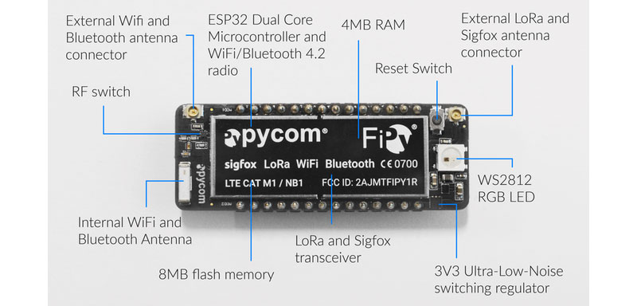

Big thanks to this event supporters


---

### Micropython Intro - Networks - PDPD May 2019 ###


<!--
Speaker Notes:
Short personal introduction

part of a larger  intro course in Micropython,

note that much of the tech info provided here is taken from micropython.org
the course borrows heavily from Radomir's course for the D1 mini
http://micropython-on-wemos-d1-mini.readthedocs.io/en/latest/index.html

-->

---

### [micropython](https://micropython.org) and [forum](https://forum.micropython.org/) ###

*Reinterpretation* of Python 3.4
optimised to run in *constrained environments*


  <!--
  speaker Notes
  why use Micropython instead of CPython?
  cannot use CPython on small, low power hardware
  Power consumption comparison
  ~80 mA during connection to WiFi
  ~15 uA during a deepsleep
  Raspberry Pi 3 in idle is 0.3A so cannot be run on batteries for a long time
  GPIO pins allow easy interaction by using modules that provide abstraction
  Opportunity for Python developers to extend into IOT solutions

  Reinterpretation of Cpython means with respect to language syntax, and most of the features of MicroPython are identical to those described by the “Language Reference” documentation at docs.python.org."

  MicroPython aims to be as compatible with normal Python as possible to allow you to transfer code with ease from the desktop to a microcontroller or embedded system

  very limited RAM means 256k of code space and 16k of RAM (show Micro-bit)

  significant development in the language based on specific user needs
  similarities with Linux distros; same core kernel different implementations

  -->

---

### [D1 mini](https://wiki.wemos.cc/products:d1:d1_mini) ###


<!--
speaker Notes
basic board
discuss UART, SPI, I2C, A0
pinout diagram

-->

---

### [FiPy](https://pycom.io/solutions/hardware/) ###



<!-- 
speaker notes
although the wemos has a wifi chip, Pycom's dev boards have a range of networking options

-->

---
### Using micropython ###

#### Basic REPL interface ####

- basic operators
- input history, tab completion
- paste mode (ctrl + e)
- modules, functions, classes
- lists, tuples, dictionaries

<!--
speaker Notes
participants should exit this slide being able to enter repl, execute code and return to shell
also be able to use a text editor and paste function in repl
-->

---

### basics - esp8266 modules ###

- esp8266 modules
 - esp, [machine](https://docs.micropython.org/en/latest/esp8266/library/machine.html)
- micropython modules
 - gc, uos

<!--
speaker Notes
introduction to micropython specific modules
understand the 'u' prefix
get help at http://docs.micropython.org/en/v1.9.2/esp8266/index.html
-->

---

### main ways to interact with microcontrollers ###

- direct REPL ~ quick testing & behaviour
- paste mode ~ copy blocks of code from editor to REPL
- IDE ~ use text editor and microcontroller filesystem
  - upy always runs boot.py then main.py on boot


---
### 'hello world' of microcontrollers ###

D1 mini has its own LED connected to GPIO2 (D4)

```
from machine import Pin

led = Pin(2, Pin.OUT)
led (0)
led (1)

```

- TASK flash led 5 times
- TASK create functions to support fault finding (program running OK, fault in network connection, cannot read sensor, etc)
<!--
Speaker Notes
the onboard led is connected to GPIO2 which has a pull up resistor, so the led is on when the signal is pushed low
need to introduce time/utime module to achieve tasks
-->
---
### PWM - Pulse Width Modulation ###


- use a digital signal in an 'analog fashion'
- Frequency (Hz)is how often a signal switches between low voltage and high voltage.
- Duty cycle is percent of time that the signal stays at high level (0->1023)

+++

### PWM control of on-board LED ###

```
from machine import Pin, PWM
import time

pwm = PWM(Pin(2)) #create PWM object

pwm.duty(0)       #led is always on
pwm.duty(1023)    #is always off

for i in range (1023):
  pwm.duty(i)
  time.sleep(0.01)

pwm.duty(512)     #set half way in between
pwm.freq(1)       #now set frequency at 1 hz

```


---

### buzzer shield MLT-8540 ###


+++
### using the buzzer shield
```
from machine import Pin, PWM
import time

pwm = PWM(Pin(14), freq=440, duty=512)
time.sleep(1)
pwm.deinit()

```
Freq; c: 262, 'd': 294, 'e': 330, 'f': 349, 'g': 392, 'a': 440,'b': 494,'C': 523,
- rhythm is achieved by gaps between tones
- max frequency available on the D1 mini is only 1000hz

- TASK develop a two tone alert
- TASK [RTTTL](https://en.wikipedia.org/wiki/Ring_Tone_Transfer_Language) use the [RTTTL library](https://github.com/dhylands/upy-rtttl) to perform a little 90's ringtone retro using the following string
'TakeOnMe:d=4,o=4,b=160:8f#5,8f#5,8f#5,8d5,8p,8b,8p,8e5,8p,8e5,8p,8e5,8g#5,8g#5,8a5,8b5,8a5,8a5,8a5,8e5,8p,8d5,8p,8f#5,8p,8f#5,8p,8f#5,8e5,8e5,8f#5,8e5,8f#5,8f#5,8f#5,8d5,8p,8b,8p,8e5,8p,8e5,8p,8e5,8g#5,8g#5,8a5,8b5,8a5,8a5,8a5,8e5,8p,8d5,8p,8f#5,8p,8f#5,8p,8f#5,8e5,8e5'

---
### Temperature/Humidity shield DHT12 ###


+++

### explaining I2C


+++

### polling sensor ###

use [dht12 library](https://github.com/mcauser/micropython-dht12)
also available using [upip](https://docs.micropython.org/en/latest/reference/packages.html#upip-package-manager)
```
import time
import dht12
from machine import I2C, Pin
i2c = I2C(scl=Pin(5), sda=Pin(4))
sensor = dht12.DHT12(i2c)

while True:
	sensor.measure()
	print('temp is: ', sensor.temperature())
	print('humidity is: ', sensor.humidity())
	time.sleep(10)
```


---
### network module ###
connecting to local wifi network (not as a access point)
```
 import network
 sta = network.WLAN(network.STA_IF)
 sta.active(True)
 sta.connect("network-name", "password")
```
at this point the d1 mini should be connected to the network

```
sta.isconnected() #should return True
sta.ifconfig()    #should return your IP address
```
+++

### [Star Wars Asciimation](https://docs.micropython.org/en/latest/esp8266/esp8266/tutorial/network_tcp.html?highlight=star) using sockets ###

```
import socket
addr_info = socket.getaddrinfo("towel.blinkenlights.nl", 23)
addr = addr_info[0][-1]
s = socket.socket()
s.connect(addr)
while True:
   data = s.recv(500)
   print(str(data, 'utf8'), end='')
```
---

challenges

- building [resilient code](https://github.com/peterhinch/micropython-samples/tree/master/resilient) (frequent wifi network dropouts)

---

### [MQTT](http://mqtt.org/) ###

- m2m lightweight messaging protocol
- publish / subscribe model
- for connections  where a small code footprint is required
-  and/or network bandwidth is at a premium.

+++


+++
### MQTT publish using [uMQTT.simple](https://github.com/micropython/micropython-lib/tree/master/umqtt.simple)

```
from umqtt.simple import MQTTClient

c=MQTTClient('phil_sensor', 'iot.eclipse.org') #default port is 1883

c.connect()
c.publish('RIFF/phil/temperature', 'here is my data')
c.disconnect()
```

+++

so develop your own temperature/humidity node!
```
import time
import dht12
from machine import I2C, Pin
from umqtt.simple import MQTTClient

i2c = I2C(scl=Pin(5), sda=Pin(4))
sensor = dht12.DHT12(i2c)
c=MQTTClient('phil_sensor', 'iot.eclipse.org')

while True:
	sensor.measure()
	print('temp is: ', sensor.temperature())
	print('humidity is: ', sensor.humidity())
  c.connect()
  c.publish('RIFF/phil/temperature', (sensor.temperature()))
  c.publish('RIFF/phil/humidity', (sensor.humidity())
  c.disconnect()
	time.sleep(10)
```

+++

if you want to download a simple MQTT client on your laptop, consider mosquitto

```
sudo apt-get install mosquitto mosquitto-clients

mosquitto_sub -h 'iot.eclipse.org' -t RIFF/#

```
a good simple phone MQTT client is [MQTT dashboard](https://play.google.com/store/apps/details?id=com.thn.iotmqttdashboard&hl=en_AU) for Android


---

### other resources ###

- [flashing micropython firmware](https://docs.micropython.org/en/latest/esp8266/esp8266/tutorial/intro.html#getting-the-firmware)
