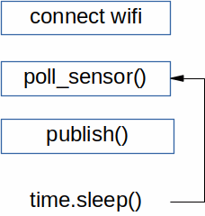
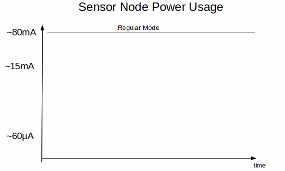
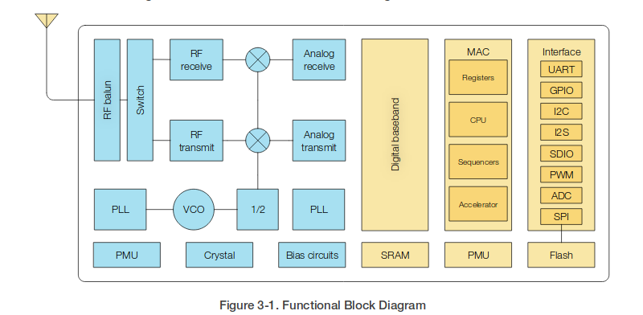
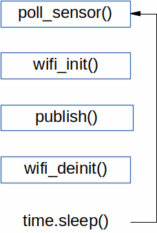
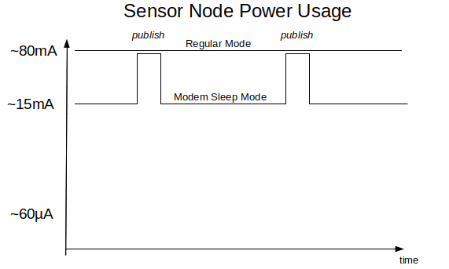
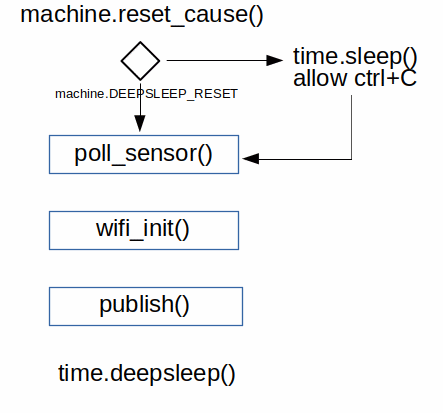
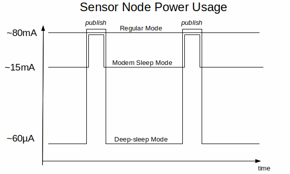

 ### Micropython MeetUp - PDPD August 2018 - Low Power Mode Options ESP8266

<!--
MeetUp workshop to discuss Deep-sleep mode and RTC.memory on ESP8266
-->

---
Big thanks to this event supporters

---

### PDPD Micropython News
- two sessions; ongoing workshop at Artisfactory
- good talks at [Pycon-AU] by Damien and ???
- also at Europython by ???

---

### interacting with the esp8266 ###

- refer to previous workshops Github
- DHT12 sensor and networking

---
### IOT based solutions

1. low cost microcontrollers
2. connected devices
3. **low power**

<!-- the expected massive explosion in IOT devices relies on three legs.  We will investigate the final leg; Low Power -->

---
### use case - environmental sensor
# need photo here
- temperature and humidity readings
- reading every minute
- placed within wifi range
- no power available; batteries only

---

### Regular Mode
- ESP8266 on; wifi connected
- use time module to sleep between polls
 - or timer callback functions

---

---

---?code=code/boot.py&title=boot file

---?code=code/main_regularex.py&title=regular main.py file
@[1-4](import libraries)
@[6-12](temperature and humidity)
@[14-19](publish via MQTT)
@[21-24]

<!-- example code for Regular 'always on' Node -->
---

- using a [18650 LiPo bought from Bunnings](https://www.bunnings.com.au/solar-magic-2200mah-lithium-ion-rechargeable-batteries-2-pack_p4352437)
- 3.7V x 2.2Ahr = 3.3V x 0.080A x battery life
- battery life = (3.7x2.2)/(3.3x0.08) max=31 hours
---

### Modem Sleep Mode
- from [Espressif ESP8266  datasheet](https://www.espressif.com/sites/default/files/documentation/0a-esp8266ex_datasheet_en.pdf)

---

---
---?code=code/main_modemsleepex.py&title= using Modem Sleep  main_modemsleepex.py

<!-- flowchart and code: switch off wifi when not in use
-->
---

- 5s in each minute to connect to wifi and publish
- LiPo life approx 153hrs (6.4 days)

<!-- calculation shows better performance but still unsuitable for IOT devices
-->
---

### deepsleep
- CPU
- RTC wakes CPU on Pin #

---
REPL
- machine.deepsleep()
- beware endless deepsleep loops
 - use machine.reset_cause() & constants

---

---
---?code=code/main_deepsleepex.py&title= using Deepsleep  main_deepsleepex.py

<!-- flowchart and code: using Deepsleep function
-->
---

---
