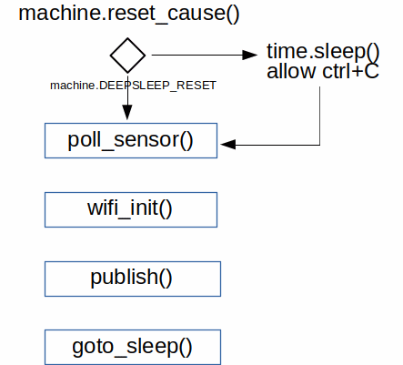
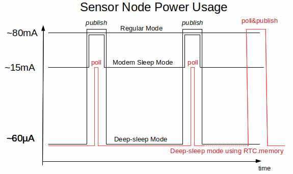

 ### Micropython MeetUp
 #### PDPD August 2018
 #### Low Power Mode Options ESP8266


<!--
MeetUp workshop to discuss Deep-sleep mode and RTC.memory on ESP8266
-->

---
Big thanks to this event supporters


---

### PDPD Micropython News
- two sessions; ongoing maker workshop at Artisfactory and CBD Workshops
- good talks at [Pycon-AU]
 - writing fast and efficient Micropython [Damien George](https://www.youtube.com/watch?v=hHec4qL00x0&t=4s)
  - asyncio in micropython [Matt Trentini](https://www.youtube.com/watch?v=tIgu7q38bUw&t=4s)
 - demystifying LoRaWAN with PYCOM  by [Brian Danilko](https://www.youtube.com/watch?v=L-fh7PSpPMc)
 - also [Andrey Vlasovskikh](https://www.youtube.com/watch?v=Hy0W8tBpZu4) at Europython discussing differences in coding micropython

---

### interacting with the esp8266 ###

- refer to previous workshops Github
- DHT12 sensor and networking

---
#### IOT based solutions

1. low cost microcontrollers
2. connected devices
3. **low power**

<!-- the expected massive explosion in IOT devices relies on three legs.  We will investigate the final leg; Low Power -->

---
### use case - environmental sensor
# need photo here
- temperature and humidity readings
- reading every minute
- placed within wifi range
- no power available; batteries only

---

### Regular Mode
- ESP8266 on; wifi connected
- use time module to sleep between polls
 - or timer callback functions

---


---?code=code/boot.py&title=boot file

---?code=code/main_regularex.py&title=regular main.py file
@[1-4](import libraries)
@[6-12](temperature and humidity)
@[14-19](publish via MQTT)
@[21-24]

<!-- example code for Regular 'always on' Node -->
---


- using a [18650 LiPo bought from Bunnings](https://www.bunnings.com.au/solar-magic-2200mah-lithium-ion-rechargeable-batteries-2-pack_p4352437)
- 3.7V x 2.2Ahr = 3.3V x 0.080A x battery life
- battery life = (3.7x2.2)/(3.3x0.08) max=31 hours
---

### Modem Sleep Mode
- from [Espressif ESP8266  datasheet](https://www.espressif.com/sites/default/files/documentation/0a-esp8266ex_datasheet_en.pdf)


---


---?code=code/main_modemsleepex.py&title= using Modem Sleep  main_modemsleepex.py
@[16-21](wifi initiated in main script)
@[30-32](wifi deinit as soon as possible)
@[34-40]

<!-- flowchart and code: switch off wifi when not in use
-->
---


- 5s in each minute to connect to wifi and publish
- LiPo life approx 120.8hrs (5 days)

<!-- calculation shows better performance but still unsuitable for IOT devices
-->
---

### deepsleep
- wifi unit off, CPU off, RTC is on
- RTC resets CPU via GPIO-16 (D0 on Wemos D1 mini)


---
### [deepsleep](http://docs.micropython.org/en/v1.9.2/esp8266/esp8266/tutorial/powerctrl.html) on the REPL

hardware! GPIO-16 connected to reset

```
rtc.irq(trigger=rtc.ALARM0 wake=machine.DEEPSLEEP)
rtc.alarm(rtc.ALARM0, (10000))
machine.deepsleep()
```

beware endless deepsleep loops
 - use machine.reset_cause() & constants


---



---?code=code/main_deepsleepex.py&title= using Deepsleep  main_deepsleepex.py
@[37-38](allows user to Ctrl+C when not waking from deepsleep)
@[31-35](sets alarm callback and initiates deepsleep)

<!-- flowchart and code: using Deepsleep function
-->
---


- 5s in each minute to connect to wifi and publish
- LiPo life approx 342 hours (14 days)
---

### Deepsleep challenges
- all memory is lost on deepsleep
- using EEPROM wears out flash
- Espressif provided a useful option in RTC

---
### RTC.memory
- limited memory available in addition to the clock
- 512 bytes user memory available (in 4 byte blocks refer to [espressif docs](https://www.espressif.com/sites/default/files/2C-ESP8266_Non_OS_SDK_API_Reference__EN.pdf))
- excellent YouTube video by [Andreas Spiess](https://www.youtube.com/watch?v=r-hEOL007nw&index=14&list=PL3XBzmAj53Rlu3Byy_GkqG6b-nwEpWku0)

---
### REPL
- rtc = machine.RTC()
- rtc.memory(b'')
- rtc.memory().decode('utf-8')


---?code=code/main_rtcmemex.py&title= using RTC memory and Deepsleep  main_rtcmemex.py
@[36]
@[38-44]
@[46-50]
@[46-53]
@[46-58]


<!-- flowchart and code: using RTC.memory function
-->
---


- 1s every min to poll_sensor
- 5s every 10 mins connect to wifi and publish
- LiPo life approx 1987 hours (83 days)

---
---
